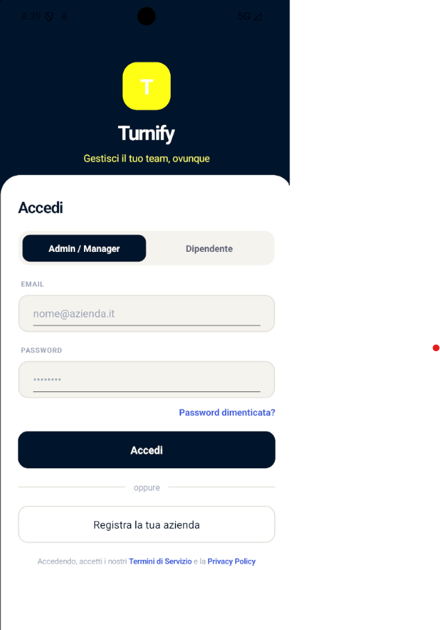
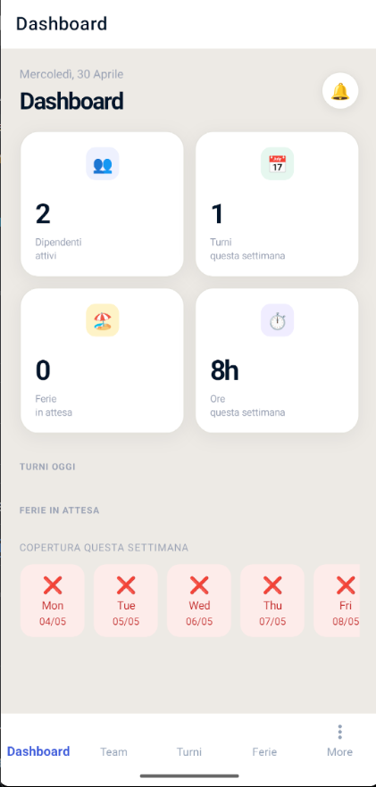
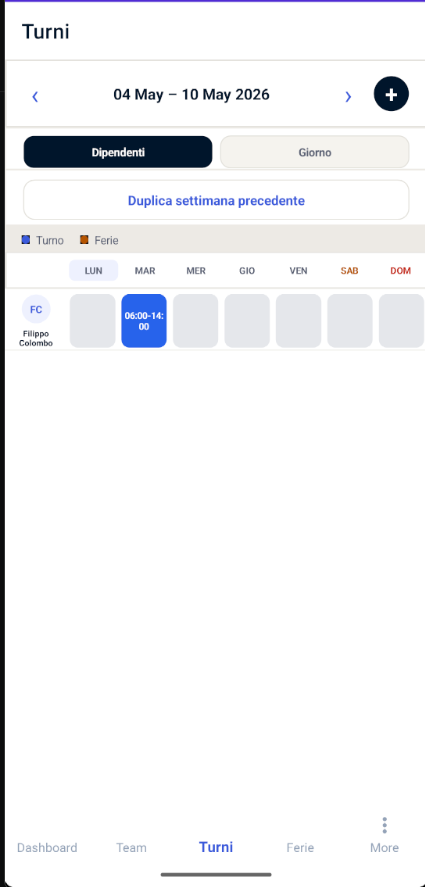
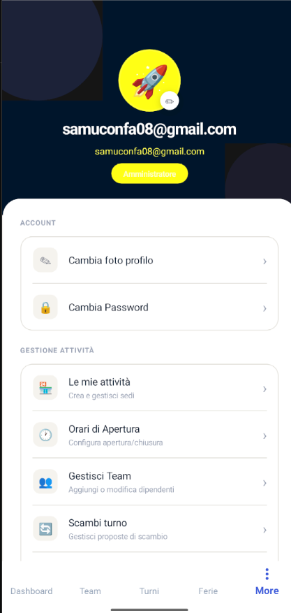

# Turnify

App mobile per la gestione dei turni lavorativi nelle piccole e medie imprese italiane — bar, ristoranti, negozi, palestre.

---

## Il problema

Bar, ristoranti, negozi e palestre gestiscono ancora i turni via WhatsApp e fogli Excel. Il risultato sono cambi dell'ultimo minuto non tracciati, ferie ignorate e manager esasperati. Turnify centralizza tutto: pianificazione turni, timbratura presenze e gestione ferie in un'unica piattaforma, con ruoli distinti tra titolare e dipendente.

---

## Stack tecnologico

| Layer | Tecnologia |
|---|---|
| App mobile | .NET MAUI 10 — Android (target principale), iOS, macOS, Windows |
| Pattern architetturale | Clean Architecture + MVVM |
| MVVM toolkit | CommunityToolkit.Mvvm 8.4.2 |
| Backend | ASP.NET Core 10 Web API |
| Database | MySQL via EF Core + Pomelo |
| Autenticazione | JWT (access 15 min + refresh 7 giorni) |
| Portale web | Next.js 14 + TypeScript + Tailwind CSS |
| Test | xUnit + Moq + FluentAssertions (122 test) |
| Hosting | VPS Linux con Nginx + PM2 |

---

## Struttura del repository

```
Turnify/
├── src/
│   ├── Turnify.Mobile/         # App MAUI (Views, ViewModels, Services)
│   ├── Turnify.Api/            # REST API (Controllers, DTOs, Validators)
│   ├── Turnify.Core/           # Modelli di dominio e interfacce
│   ├── Turnify.Infrastructure/ # EF Core, Repository, Services concreti
│   ├── Turnify.Tests/          # Unit test e Integration test
│   └── Turnify.Web/            # Portale web admin (Next.js)
├── docs/
│   ├── spec.md                 # Specifica funzionale completa
│   ├── plan.md                 # Piano di lavoro con 14 iterazioni
│   ├── architecture.md         # Architettura tecnica e flusso dati
│   ├── api-notes.md            # Documentazione endpoint API
│   ├── test-matrix.md          # Matrice di test con esiti e bug
│   ├── prompt-log.md           # Log dei 36 prompt AI significativi
│   ├── deployment.md           # Build, APK, deploy VPS
│   ├── demo-script.md          # Scaletta presentazione finale
│   └── iterations/             # Log delle 14 iterazioni di sviluppo
├── assets/
│   └── screenshots/            # Screenshot dell'app
├── AGENTS.md                   # Regole per agenti AI
└── CLAUDE.md                   # Istruzioni specifiche per Claude Code
```

---

## Funzionalità

### Admin / Titolare
- Dashboard con KPI: turni del giorno, ferie pendenti, ore pianificate
- Calendario turni settimanale con creazione, modifica e ricorrenza
- Gestione dipendenti: creazione, modifica, assegnazione a sedi
- Approvazione e rifiuto richieste ferie
- Gestione sedi (Business) con orari di apertura/chiusura
- Export report CSV: ore pianificate e presenze per intervallo date
- Portale web dedicato su `/admin`

### Dipendente
- Dashboard personale con turno del giorno e stato presenza
- Timbratura: check-in e check-out dall'app mobile
- Storico presenze con orari in ora locale
- Richiesta ferie con tipi (Ferie, Permesso, Malattia)
- Impostazione giorni disponibili
- Download report CSV personale

### Sicurezza
- JWT con access token 15 min e refresh token 7 giorni
- Certificate pinning Android (`CertificatePinningHandler`)
- Rate limiting per-IP: 10 req/min su `/auth`, 120 req/min globale
- Validazione input con FluentValidation su tutti gli endpoint critici
- Credenziali in variabili d'ambiente (mai nel repository)
- HTTPS obbligatorio, GDPR consent al primo avvio

---

## Screenshots

| Login | Dashboard Admin | Calendario Turni |
|---|---|---|
|  |  |  |

| Profilo |
|---|
|  |

---

## Prerequisiti

- [.NET SDK 10.0](https://dotnet.microsoft.com/download/dotnet/10.0)
- Visual Studio 2022 v17.12+ con workload **.NET MAUI** e **ASP.NET**
- Android SDK (API 21+) per il target mobile
- MySQL 8.0+ per il database
- Node.js 20+ (solo per il portale web)

---

## Configurazione ambiente

### 1. Variabili d'ambiente backend

Crea il file `src/Turnify.Api/.env` (non committare mai questo file):

```env
ConnectionStrings__Default=Server=localhost;Database=turnify;User=root;Password=tuapassword;
Jwt__Secret=una-chiave-segreta-di-almeno-32-caratteri
Jwt__Issuer=https://api.turnify.it
Jwt__Audience=turnify-mobile-app
Smtp__Host=smtp.example.com
Smtp__Port=587
Smtp__Username=user@example.com
Smtp__Password=tuapassword
```

Il file `.env.example` nel repository mostra tutte le chiavi richieste senza valori reali.

### 2. Database

```bash
cd src/Turnify.Api
dotnet ef database update
```

Questo applica tutte le migrazioni in ordine. Il database viene creato automaticamente se non esiste.

---

## Avvio in sviluppo

### Backend

```bash
cd src/Turnify.Api
dotnet run
```

Swagger UI disponibile su `https://localhost:<porta>/swagger` (solo in Development).

### App mobile (Android)

```bash
cd src/Turnify.Mobile
dotnet build -t:Run -f net10.0-android
```

La base URL dell'API è configurata in `MauiProgram.cs` nella costante `API_BASE`.

### Portale web (opzionale)

```bash
cd src/Turnify.Web
npm install
npm run dev
```

Portale disponibile su `http://localhost:3000/admin`.

---

## Build APK (Release)

```bash
cd src/Turnify.Mobile
dotnet publish -f net10.0-android -c Release
```

L'APK viene generato in `src/Turnify.Mobile/bin/Release/net10.0-android/`.

Per la firma con keystore di produzione:

```bash
dotnet publish -f net10.0-android -c Release \
  -p:AndroidKeyStore=true \
  -p:AndroidSigningKeyStore=<path.keystore> \
  -p:AndroidSigningKeyAlias=<alias> \
  -p:AndroidSigningKeyPass=<password> \
  -p:AndroidSigningStorePass=<password>
```

---

## Eseguire i test

```bash
cd src/Turnify.Tests
dotnet test
```

La suite include 122 test: unit test su Service e Repository, integration test con `WebApplicationFactory` su tutti i controller principali.

---

## Deploy in produzione

Il backend è deployato su VPS all'indirizzo:

```
https://samuconfa.it/turnify/
```

Health check: `GET https://samuconfa.it/turnify/health`

Il portale web è raggiungibile su:

```
https://samuconfa.it/admin
```

Per i dettagli completi sul processo di build e deploy vedere [`docs/deployment.md`](docs/deployment.md).

---

## Documentazione

| File | Contenuto |
|---|---|
| [`docs/spec.md`](docs/spec.md) | Specifica funzionale completa con criteri di accettazione |
| [`docs/plan.md`](docs/plan.md) | Piano di lavoro con le 14 iterazioni documentate |
| [`docs/architecture.md`](docs/architecture.md) | Architettura Clean Architecture, MVVM, flusso dati |
| [`docs/api-notes.md`](docs/api-notes.md) | Tutti gli endpoint API con parametri e risposte |
| [`docs/test-matrix.md`](docs/test-matrix.md) | Matrice di test con esiti, bug trovati e fix |
| [`docs/prompt-log.md`](docs/prompt-log.md) | Log dei 36 prompt AI con decisioni e motivazioni |
| [`docs/deployment.md`](docs/deployment.md) | Build APK, configurazione VPS, checklist pre-release |
| [`docs/demo-script.md`](docs/demo-script.md) | Scaletta della presentazione finale (10-12 min) |
| [`docs/iterations/`](docs/iterations/) | Log dettagliato delle 14 iterazioni di sviluppo |

---

## Iterazioni di sviluppo

Il progetto è stato sviluppato in 14 iterazioni incrementali dal 21 aprile al 4 maggio 2026, ciascuna documentata in `docs/iterations/`. Ogni iterazione corrisponde a un tag Git annotato:

```
it-01-bootstrap      → Setup soluzione, dominio, EF Core, JWT, Shell MAUI
it-02-maui-login     → LoginPage reale, AuthService mobile, test unitari
it-03-api-admin      → CRUD dipendenti, ferie, dashboard con dati reali
it-04-gdpr-onboard   → GDPR consent, onboarding, push notification FCM
it-05-redesign       → Redesign UI, timbratura presenze, ricorrenza turni
it-06-web            → Portale web Next.js, deploy VPS
it-07-production     → Reportistica CSV, reset password, rate limiter
it-08-security       → FluentValidation, certificate pinning, 122 test
it-09-username       → Login dipendente con username, indice univoco
it-10-calendar       → Calendario avanzato, report ore dipendenti
it-11-gaps           → Refresh token, EmojiPickerViewModel, Day View
it-12-13-advanced    → Sessione persistente, swap turni, copertura dashboard
it-14-caching        → Caching SQLite stale-while-revalidate
```

---

## Permessi Android

| Permesso | Motivo |
|---|---|
| `INTERNET` | Chiamate API REST al backend |
| `ACCESS_NETWORK_STATE` | Verifica disponibilità rete |

---

## Licenza

Distribuito sotto licenza Apache 2.0. Vedi [`LICENSE`](LICENSE) per i dettagli.
