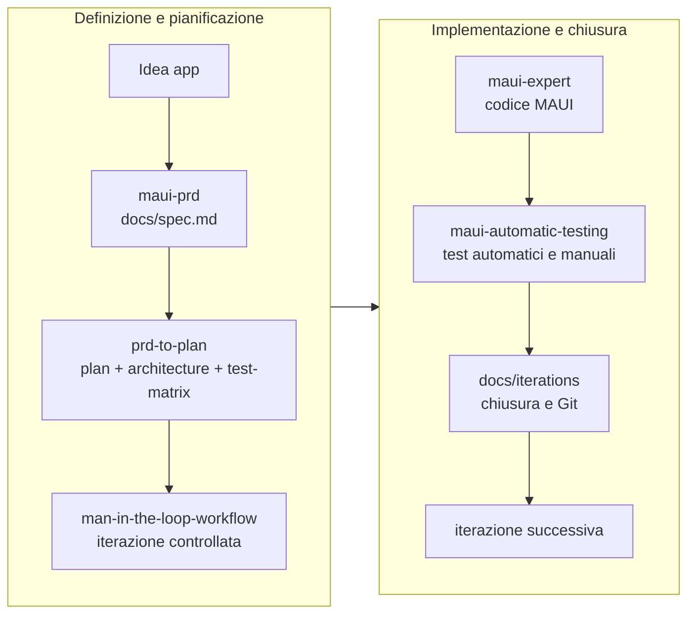

<div align="center">

# BookScout Mobile Skills Lab

Demo didattica per progettare, pianificare e governare una app `.NET MAUI` Android-first con agenti AI, skill riusabili e workflow Man-in-the-Loop.

[](https://learn.microsoft.com/dotnet/maui/)
[](docs/method/man-in-the-loop.md)
[](.agents/skills/)
[](docs/)
[](.claude/skills/)
[](https://github.com/GreppiDev/maui-project-demo)

[Panoramica](#panoramica) ·
[Stack Di Skill](#stack-di-skill) ·
[Workflow](#workflow) ·
[Strategia Git](#strategia-git) ·
[Documenti](#documenti) ·
[Cronologia](#cronologia) ·
[Come Leggere](#come-leggere)

</div>

---

## Panoramica

Questo repository non è ancora il codice completo dell'app `BookScout Mobile`. È prima di tutto un laboratorio didattico per mostrare come usare agenti AI senza perdere controllo su analisi, pianificazione, review, test e documentazione.

L'app di riferimento è una app `.NET MAUI` Android-first per ricerca libri, dettagli, preferiti e storico. Il cuore del repo, però, è il sistema che prepara lo sviluppo:

| Area | Cosa contiene | Link |
| --- | --- | --- |
| Prodotto | PRD e requisiti di `BookScout Mobile` | [docs/spec.md](docs/spec.md) |
| Pianificazione | Iterazioni, architettura e matrice test | [docs/plan.md](docs/plan.md), [docs/architecture.md](docs/architecture.md), [docs/test-matrix.md](docs/test-matrix.md) |
| Skill | Skill locali per PRD, planning, MAUI, test e workflow | [`.agents/skills/`](.agents/skills/) |
| Claude Code | Link simbolici alle skill OpenCode senza duplicazione | [`.claude/skills/`](.claude/skills/) |
| Metodo | Workflow didattico Man-in-the-Loop | [docs/method/man-in-the-loop.md](docs/method/man-in-the-loop.md) |
| Evidenze | Sessioni, eval, benchmark e refinement | [docs/history/](docs/history/) |

La cartella [`src/`](src/) è al momento una radice predisposta: il repository documenta soprattutto metodo, skill e progettazione prima dell'implementazione applicativa.

## Perché Esiste

Nel contesto didattico del progetto, l'AI non viene trattata come un generatore automatico di codice. Viene usata come collaboratore dentro un processo controllato.

Il repository mostra come:

- trasformare un'idea di app in un `PRD` verificabile;
- derivare dal `PRD` un piano in iterazioni piccole;
- usare skill specializzate invece di prompt generici;
- tenere separati prodotto, architettura, test e implementazione;
- migliorare le skill con eval, baseline e refinement successivi;
- mantenere responsabilità umana su decisioni, review, test, merge e push.

## Stack Di Skill

| Skill | Badge | Quando usarla |
| --- | --- | --- |
| [`find-skills`](.agents/skills/find-skills/) |  | Cercare o installare skill esterne |
| [`skill-creator`](.agents/skills/skill-creator/) |  | Creare, testare e raffinare skill |
| [`prd`](.agents/skills/prd/) |  | Skill PRD generica usata come confronto |
| [`maui-prd`](.agents/skills/maui-prd/) |  | Definire o aggiornare il PRD MAUI |
| [`prd-to-plan`](.agents/skills/prd-to-plan/) |  | Trasformare il PRD in piano, architettura e test matrix |
| [`maui-expert`](.agents/skills/maui-expert/) |  | Scrivere o rivedere codice `.NET MAUI` |
| [`maui-automatic-testing`](.agents/skills/maui-automatic-testing/) |  | Definire test automatici realistici per una slice |
| [`man-in-the-loop-workflow`](.agents/skills/man-in-the-loop-workflow/) |  | Governare ogni iterazione con scope, review, test e documentazione |

Le skill reali vivono in [`.agents/skills/`](.agents/skills/). La cartella [`.claude/skills/`](.claude/skills/) contiene link simbolici verso quelle stesse skill, così Claude Code può usarle senza creare doppioni.

## Workflow



Il ciclo operativo seguito dal progetto è:

1. Planning
2. Build
3. Review
4. Testing
5. Documentazione e Git

Il dettaglio metodologico è in [docs/method/man-in-the-loop.md](docs/method/man-in-the-loop.md). La skill che lo rende operativo è [`man-in-the-loop-workflow`](.agents/skills/man-in-the-loop-workflow/).

## Strategia Git

Il repository adotta un modello di branching che separa stabilità, integrazione e sviluppo attivo, allineato al workflow Man-in-the-Loop.

### Branch model

| Branch | Scopo | Regole |
| --- | --- | --- |
| `main` | Versioni stabili con tag di release | Solo merge da `develop` quando il codice è verificato e documentato |
| `develop` | Integrazione delle iterazioni completate | Riceve i merge delle feature branch dopo review, test e approvazione umana |
| `feature/it-XX-...` | Sviluppo di una singola iterazione | Parte da `develop`, vive per tutta l'iterazione, viene eliminata dopo il merge |

### Commit per iterazione

Ogni iterazione del piano produce **più commit semantiche** all'interno del suo feature branch, non una singola commit monolitica. Questo allinea il repository al workflow a cinque fasi:

- **Build**: una o più commit `feat` man mano che il codice cresce (es. scheletro MAUI, poi ViewModels, poi servizi).
- **Review**: eventuali commit `fix` per correzioni post-review.
- **Testing**: commit `test` per test automatici o evidenze di verifica manuale.
- **Documentazione**: commit `docs` per `docs/iterations/it-XX-nome-corto.md`, aggiornamenti alla test-matrix e altri documenti di progetto.

**Perché non una sola commit per iterazione**
- Mantiene la storia leggibile e il processo trasparente (Build vs Fix vs Docs).
- Permette il revert selettivo (tornare indietro solo sui test o sulla documentazione senza toccare il codice).
- Mantiene la review focalizzata: ogni commit ha uno scopo chiaro.

### Convenzioni

**Branch**: `feature/it-XX-nome-corto` (es. `feature/it-01-bootstrap`, `feature/it-02-search`).
**Commit**: prefisso semantico in italiano o inglese, coerente nel progetto.

Esempio per IT-01:

```text
feat(it-01): bootstrap progetto MAUI, AppShell e pagine placeholder
feat(it-01): aggiunta ViewModels e dependency injection minima
test(it-01): verifica build e navigazione Search/Favorites/History
docs(it-01): log iterazione it-01 e aggiornamento test-matrix
```

### Merge e release

- I merge su `develop` avvengono solo a iterazione chiusa, testata e documentata, con approvazione esplicita.
- I tag di release su `main` seguono la convenzione `vX.Y.Z` (es. `v0.1.0-mvp`) quando `develop` raggiunge uno stato stabile.
- Non si eseguono push diretti su `main` o `develop`.

## Documenti

| Documento | Scopo |
| --- | --- |
| [docs/spec.md](docs/spec.md) | PRD di `BookScout Mobile` |
| [docs/plan.md](docs/plan.md) | Piano iterativo derivato dal PRD |
| [docs/architecture.md](docs/architecture.md) | Architettura MAUI proposta |
| [docs/test-matrix.md](docs/test-matrix.md) | Matrice dei test manuali e automatici |
| [docs/tutorial-uso-skills.md](docs/tutorial-uso-skills.md) | Guida didattica all'uso delle skill |
| [docs/skills-inventory.md](docs/skills-inventory.md) | Inventario delle skill esterne e locali |
| [docs/iterations/](docs/iterations/) | Log delle future iterazioni applicative `IT-01` - `IT-06` di `BookScout Mobile` |
| [docs/skill-iterations/](docs/skill-iterations/) | Archivio storico delle iterazioni usate per creare e rifinire le skill locali |

## Quick Start Didattico

Per usare il repository come traccia di lavoro:

1. Leggere [docs/method/man-in-the-loop.md](docs/method/man-in-the-loop.md) per capire il modello operativo.
2. Aprire [docs/spec.md](docs/spec.md) per vedere il PRD di esempio.
3. Consultare [docs/plan.md](docs/plan.md), [docs/architecture.md](docs/architecture.md) e [docs/test-matrix.md](docs/test-matrix.md).
4. Leggere [docs/tutorial-uso-skills.md](docs/tutorial-uso-skills.md) per capire quando attivare ogni skill.
5. Usare `man-in-the-loop-workflow` e `maui-expert` all'inizio delle iterazioni implementative.
6. Usare `maui-automatic-testing` prima di chiudere una slice.

## Struttura

```text
.
├── .agents/skills/          # Skill sorgente per OpenCode e agenti compatibili
├── .claude/skills/          # Link simbolici alle skill per Claude Code
├── docs/                    # Spec, piano, architettura, test matrix, skill inventory e tutorial
│   ├── method/               # Metodo didattico Man-in-the-Loop
│   ├── history/              # Trascrizioni storiche delle interazioni AI
│   ├── iterations/           # Log iterazioni applicative BookScout Mobile
│   └── skill-iterations/     # Log storici delle iterazioni sulle skill
├── src/                     # Radice predisposta per il futuro progetto MAUI
├── skills-lock.json         # Lock delle skill esterne installate
└── README.md
```

## Fonti Storiche

La ricostruzione del repository usa solo fonti locali:

| Sessione | Cosa documenta |
| --- | --- |
| [docs/history/session-ses_24b2.md](docs/history/session-ses_24b2.md) | Creazione e refinement di `maui-expert` |
| [docs/history/session-ses_24af.md](docs/history/session-ses_24af.md) | Richiesta di creare la skill Man-in-the-Loop |
| [docs/history/session-ses_24a3.md](docs/history/session-ses_24a3.md) | Confronto PRD, creazione e refinement di `maui-prd` e `prd-to-plan` |
| [docs/history/session-ses_249f.md](docs/history/session-ses_249f.md) | Uso delle skill su `BookScout Mobile` e generazione dei documenti |

## Cronologia

<details>
<summary><strong>Apri la cronologia essenziale del progetto</strong></summary>

### 1. Skill di base installate

La base iniziale contiene skill generiche non ancora specifiche per MAUI:

- `find-skills`
- `skill-creator`
- `prd`

[skills-lock.json](skills-lock.json) conferma le sorgenti:

- `find-skills` da `vercel-labs/skills`;
- `skill-creator` da `anthropics/skills`;
- `prd` da `github/awesome-copilot`.

Le skill create localmente non vengono aggiunte manualmente a `skills-lock.json`: sono asset del repository, versionati in `.agents/skills/` e catalogati in [docs/skills-inventory.md](docs/skills-inventory.md).

Le prime due sono state installate seguendo le istruzioni pubblicate su [skills.sh](https://skills.sh/):

```bash
npx skills add https://github.com/vercel-labs/skills --skill find-skills
npx skills add https://github.com/anthropics/skills --skill skill-creator
```

La skill `prd` è stata aggiunta con:

```bash
npx skills add https://github.com/github/awesome-copilot --skill prd
```

### 2. Creazione di `maui-expert`

La sessione [docs/history/session-ses_24b2.md](docs/history/session-ses_24b2.md) chiarisce il prompt originario di `maui-expert`: usare `skill-creator` per creare una skill dedicata a .NET MAUI.

La skill incorpora:

- MVVM con `CommunityToolkit.Mvvm`;
- `[ObservableProperty]` e `[RelayCommand]`;
- XAML con binding compilati (`x:DataType`);
- Shell Navigation;
- quattro stati nel ViewModel: `IsBusy`, `ErrorMessage`, `HasData`, `IsEmptyState`;
- dependency injection via costruttore;
- divieto di logica nel code-behind;
- gestione di `HttpRequestException`, `JsonException` e `TaskCanceledException`.

Refinement successivi:

- `ListView` viene trattata solo come tecnologia legacy;
- l'esempio viene rinominato in `legacy-listview-binding`;
- la skill viene rafforzata contro `OnAppearing`, `Loaded` e bridge evento-comando legati al lifecycle della pagina.

### 3. Skill `man-in-the-loop-workflow`

La sessione [docs/history/session-ses_24af.md](docs/history/session-ses_24af.md) contiene il prompt che chiede di trasformare [docs/method/man-in-the-loop.md](docs/method/man-in-the-loop.md) in una skill.

Gli artefatti finali sono:

- [`.agents/skills/man-in-the-loop-workflow/SKILL.md`](.agents/skills/man-in-the-loop-workflow/SKILL.md)
- [`.agents/skills/man-in-the-loop-workflow/evals/evals.json`](.agents/skills/man-in-the-loop-workflow/evals/evals.json)
- [`.agents/skills/man-in-the-loop-workflow/references/`](.agents/skills/man-in-the-loop-workflow/references/)
- [`.agents/skills/man-in-the-loop-workflow-workspace/`](.agents/skills/man-in-the-loop-workflow-workspace/)

I benchmark mostrano che il valore della skill emerge soprattutto quando deve produrre documenti nel formato specifico del repository.

### 4. Skill `maui-automatic-testing`

`maui-automatic-testing` è dedicata alla validazione automatica delle slice MAUI a fine iterazione.

Il repository conserva:

- [`.agents/skills/maui-automatic-testing/SKILL.md`](.agents/skills/maui-automatic-testing/SKILL.md)
- [`.agents/skills/maui-automatic-testing/evals/evals.json`](.agents/skills/maui-automatic-testing/evals/evals.json)
- [`.agents/skills/maui-automatic-testing/references/`](.agents/skills/maui-automatic-testing/references/)
- [`.agents/skills/maui-automatic-testing-workspace/`](.agents/skills/maui-automatic-testing-workspace/)

La skill aiuta a evitare UI automation prematura e privilegia test su ViewModel, service, parsing, stato UI e build verification.

### 5. Confronto della skill `prd`

La sessione [docs/history/session-ses_24a3.md](docs/history/session-ses_24a3.md) confronta la skill [`prd`](.agents/skills/prd/SKILL.md) locale con una skill PRD proveniente da un altro progetto.

Il confronto chiarisce che il repository ha bisogno di skill più specifiche per:

- studenti;
- app `.NET MAUI`;
- workflow Man-in-the-Loop;
- output in `docs/`;
- separazione tra specifica, piano, architettura e test.

### 6. Creazione di `maui-prd` e `prd-to-plan`

Sempre in [docs/history/session-ses_24a3.md](docs/history/session-ses_24a3.md), l'utente chiede due skill:

- `maui-prd`, per produrre o aggiornare `docs/spec.md`;
- `prd-to-plan`, per derivare `docs/plan.md`, `docs/architecture.md` e `docs/test-matrix.md`.

Gli artefatti principali sono:

- [`.agents/skills/maui-prd/SKILL.md`](.agents/skills/maui-prd/SKILL.md)
- [`.agents/skills/prd-to-plan/SKILL.md`](.agents/skills/prd-to-plan/SKILL.md)
- [docs/skill-iterations/skill-it-02-prd-skills.md](docs/skill-iterations/skill-it-02-prd-skills.md)

### 7. Test e refinement delle skill documentali

Dopo la creazione, le skill vengono confrontate con baseline senza skill e poi raffinate.

Risultati documentati:

- [docs/skill-iterations/skill-it-03-prd-skill-refinement.md](docs/skill-iterations/skill-it-03-prd-skill-refinement.md)
- [`.agents/skills/maui-prd-workspace/iteration-2/summary.md`](.agents/skills/maui-prd-workspace/iteration-2/summary.md)
- [`.agents/skills/prd-to-plan-workspace/iteration-2/summary.md`](.agents/skills/prd-to-plan-workspace/iteration-2/summary.md)

Esiti principali:

- `maui-prd`: 5 eval su 5 favoriscono la versione con skill;
- `prd-to-plan`: 5 eval su 5 favoriscono la versione con skill;
- entrambe le skill distinguono meglio tra bozza inline, scrittura reale su filesystem e draft provvisorio.

### 8. Esposizione a Claude Code

La sessione [docs/history/session-ses_249f.md](docs/history/session-ses_249f.md) documenta la richiesta di rendere disponibili le skill anche in `.claude/skills`.

Nel checkout attuale [`.claude/skills/`](.claude/skills/) contiene link simbolici verso le skill reali in [`.agents/skills/`](.agents/skills/). In questo modo le skill definite per OpenCode restano una sola sorgente e possono essere usate anche da Claude Code.

### 9. Uso su `BookScout Mobile`

La sessione [docs/history/session-ses_249f.md](docs/history/session-ses_249f.md) usa `maui-prd` e `prd-to-plan` per generare:

- [docs/spec.md](docs/spec.md)
- [docs/plan.md](docs/plan.md)
- [docs/architecture.md](docs/architecture.md)
- [docs/test-matrix.md](docs/test-matrix.md)

La stessa sessione porta anche a [docs/tutorial-uso-skills.md](docs/tutorial-uso-skills.md).

</details>

## Come Leggere

Percorso consigliato:

1. [docs/method/man-in-the-loop.md](docs/method/man-in-the-loop.md)
2. [README.md](README.md)
3. [docs/tutorial-uso-skills.md](docs/tutorial-uso-skills.md)
4. [docs/spec.md](docs/spec.md)
5. [docs/plan.md](docs/plan.md)
6. [docs/architecture.md](docs/architecture.md)
7. [docs/test-matrix.md](docs/test-matrix.md)
8. [`.agents/skills/`](.agents/skills/)
9. workspace di eval sotto le cartelle `*-workspace`

## Limiti Noti

- Non tutte le sessioni conservano una chiusura lineare di ogni operazione.
- Alcune evidenze derivano dagli artefatti finali e dai workspace di eval, non solo dai prompt.
- `maui-automatic-testing` è ben documentata dagli artefatti locali, ma non ha nelle sessioni versionate un prompt originario completo come `maui-expert`.
- `.claude/skills/` usa link simbolici verso `.agents/skills`; la portabilità dipende dal supporto ai symlink del filesystem e da come il repository viene clonato.
- `src/` è ancora vuota: i documenti descrivono il progetto applicativo prima della sua implementazione.

## Riferimenti

- [skills.sh](https://skills.sh/)
- [vercel-labs/skills](https://github.com/vercel-labs/skills)
- [anthropics/skills](https://github.com/anthropics/skills)
- [github/awesome-copilot](https://github.com/github/awesome-copilot)
- [Materiale didattico MAUI AI-assisted development](https://malafronte.github.io/info-quarta/corso/advanced-csharp/mobile-apps/ai-assisted-development/)
- [Ralph Loop](https://www.aihero.dev/getting-started-with-ralph)
- [Ralph Loop Plugin](https://github.com/Th0rgal/opencode-ralph-wiggum)
- [GSD](https://github.com/gsd-build/get-shit-done)
- [BMAD](https://docs.bmad-method.org/)

## Conclusione

`BookScout Mobile Skills Lab` mostra come costruire un contesto operativo attorno agli agenti AI: skill, documenti, prompt, criteri di accettazione, eval e workflow.

Il punto non è generare codice il più velocemente possibile. Il punto è rendere l'uso dell'AI spiegabile, verificabile e replicabile in un progetto didattico `.NET MAUI`.
