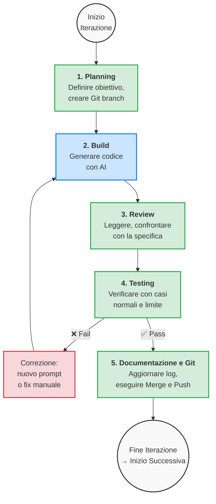

## 1. Il modello operativo: Man-in-the-Loop

Il modello di lavoro adottato è di tipo **Man-in-the-Loop** (traducibile come "l'uomo nel ciclo di controllo").  
In questo schema l'AI non opera da sola, ma interviene dentro una pipeline controllata in cui l'essere umano agisce come decisore, validatore e regista dell'intero processo.

> **Nota - Scelta didattica e pratiche agentiche**
>
> È importante chiarire che l'approccio "Man-in-the-Loop" applicato in questo corso è una **scelta puramente didattica** pensata per favorire la padronanza delle fasi di sviluppo, delle logiche architetturali e dei limiti dell'AI.
>
> Nel panorama odierno esistono già pratiche agentiche avanzate (come [*Ralph Loop*](https://www.aihero.dev/getting-started-with-ralph), [*Ralph Loop Plugin*](https://example.com/ralph-loop-plugin), framework [*GSD*](https://example.com/gsd-framework), [*BMAD*](https://docs.bmad-method.org/), ecc.) che abbattono drasticamente l'interazione umana, permettendo a un agente AI di pianificare, sviluppare, correggere e rilasciare un'intera applicazione in quasi totale autonomia. Nel nostro contesto, però, l'"imbrigliare" l'AI serve proprio ad evitare l'effetto scatola nera e garantire l'apprendimento consapevole dello studente.

### 1.1 Panoramica del ciclo

Ogni iterazione di lavoro segue un ciclo a cinque fasi:



**Legenda**: le fasi in verde sono a prevalente responsabilità umana; la fase in azzurro è quella in cui l'AI produce il codice; la fase in rosso indica la correzione quando un test fallisce.

### 1.2 Fase 1: Planning

La fase di Planning precede qualsiasi attività di coding.  
Lo sviluppatore definisce chiaramente l'obiettivo della singola iterazione e viene richiesto all'AI un piano breve e motivato.

In questa fase lo sviluppatore deve:

- stabilire un obiettivo verificabile (es. "aggiungere la pagina di dettaglio di un libro");
- definire i file che verranno creati o modificati;
- identificare le dipendenze da altre parti del progetto;
- scrivere i criteri di accettazione ("la feature è completa quando…");
- stimare la complessità dell'iterazione;
- **creare un nuovo branch Git** dedicato all'iterazione o alla feature (es. `git checkout -b feature/book-detail` oppure `git checkout -b it-03-dettaglio`). Il branch isolerà le modifiche di questa feature fino al suo completamento;

**Esempio pratico di obiettivo ben formulato:**

> *"Implementare il file `BookDetailViewModel.cs` contenente le proprietà `Title`, `Author`, `Description`, `CoverUrl` e un `ICommand LoadBookCommand` che chiami il service `IBookService.GetBookByIdAsync(string id)`. Gestire le proprietà `IsBusy`, `ErrorMessage` e `HasData`. Non creare il file XAML in questa iterazione."*

**Esempio di obiettivo mal formulato:**

> *"Crea la pagina del dettaglio del libro"*

La differenza è evidente: il primo obiettivo è verificabile, limitato e preciso; il secondo è vago e potrebbe portare l'AI a generare contemporaneamente ViewModel, View, Service e Model senza controllo.

**Prompt esempio per il planning:**

```text
Analizzare l'idea di una app MAUI chiamata BookScout Mobile.
Restituire:
1) obiettivo dell'app,
2) utente target,
3) 5 user story principali,
4) requisiti non funzionali,
5) rischi principali.
Non generare codice.
```

### 1.3 Fase 2: Build

Nella fase di Build vengono implementate soltanto le modifiche necessarie per quella specifica iterazione.  
L'AI viene utilizzata per generare il codice, ma sempre partendo da un prompt strutturato che include contesto, obiettivo, vincoli e formato atteso.

**Regole operative per la fase di Build:**

- ogni prompt deve riguardare al massimo una feature;
- il contesto del progetto deve essere fornito esplicitamente (architettura, file esistenti, convenzioni);
- i vincoli tecnici devono essere dichiarati (es. "usa MVVM", "non aggiungere pacchetti NuGet");
- il formato della risposta deve essere specificato (es. "restituisci solo il codice C#, senza spiegazioni");
- se il codice generato è troppo lungo o tocca troppi file, è meglio dividere la richiesta in sotto-prompt.

**Prompt esempio per la build:**

```text
Scrivere solo il service REST per SearchBooksAsync.
Vincoli:
- usare HttpClient con chiamata asincrona;
- gestire timeout ed errori di connessione con try/catch;
- restituire una List<BookDto> o una lista vuota in caso di errore;
- non scrivere ancora la View o il ViewModel;
- separare il DTO dal service in file diversi;
- usare System.Text.Json per la deserializzazione.
```

**Altro esempio di prompt per la build:**

```text
Implementare soltanto l'iterazione 2 del piano:
- creare il file src/BookScout.Mobile/Services/BookService.cs;
- creare il file src/BookScout.Mobile/Models/BookDto.cs;
- creare il file src/BookScout.Mobile/ViewModels/SearchViewModel.cs;
- gestione base di IsBusy, ErrorMessage e lista risultati.
Vincoli:
- architettura MVVM;
- usare CommunityToolkit.Mvvm per ObservableProperty e RelayCommand;
- HttpClient iniettato tramite costruttore;
- non toccare i file XAML esistenti.
Aggiornare anche docs/iterations/it-02-search.md con il resoconto.
```

### 1.4 Fase 3: Review

Il codice generato dall'AI deve essere letto interamente, confrontato con la specifica e corretto se necessario.  
Questa fase è critica: saltarla equivale a fare Vibe Coding.

Durante la review lo sviluppatore deve verificare:

- che il codice rispetti l'architettura MVVM (logica nei ViewModel, non nel code-behind);
- che i nomi di classi, metodi e proprietà siano coerenti con le convenzioni del progetto;
- che non siano state introdotte dipendenze non richieste;
- che la gestione degli errori sia presente e corretta;
- che il codice sia leggibile e comprensibile;
- che non ci siano duplicazioni rispetto a codice già esistente.

**Prompt esempio per la review:**

```text
Revisionare il file seguente.
Indicare:
- problemi di naming,
- logica mal collocata (es. chiamate REST nel code-behind),
- nullability non gestita,
- possibili refactoring,
- test suggeriti.
Non riscrivere ancora il codice, solo elencare i problemi trovati.
```

### 1.5 Fase 4: Testing

La feature viene verificata con casi di test normali e casi limite.  
Una feature va considerata completata solo dopo una verifica concreta sul dispositivo o sull'emulatore.

**Matrice minima di test per ogni iterazione:**

| Area | Verifiche da eseguire |
| --- | --- |
| **Input** | campi vuoti, input non valido, input molto lungo, caratteri speciali |
| **API** | risposta corretta, errore HTTP (404, 500), timeout, JSON malformato, risposta vuota |
| **UI** | stato loading visibile, stato errore mostrato, lista vuota gestita, lista lunga scrollabile |
| **Navigazione** | apertura pagina corretta, ritorno alla pagina precedente, passaggio parametri |
| **Persistenza** | salvataggio corretto, riapertura dopo chiusura app, modifica di un dato salvato |
| **Device** | tema chiaro e scuro, rotazione schermo, permessi negati dall'utente |

**Prompt esempio per il testing:**

```text
Dato questo ViewModel, proporre:
- 8 casi di test manuale con passi precisi;
- 5 edge case (casi limite);
- eventuali test unitari utili per la logica non-UI.
Non generare ancora codice di test, solo la lista dei casi.
```

### 1.6 Fase 5: Documentazione e Git

Durante l'intero ciclo di sviluppo dell'iterazione, le migliori pratiche (sia tradizionali che AI-assisted) prevedono di effettuare **salvataggi frequenti e atomici**. Ogni volta che l'AI (o lo sviluppatore) genera un blocco di codice coerente, testato e funzionante (es. un DTO, un Service API, o un fix mirato), si dovrebbe registrare un salvataggio del lavoro con un messaggio descrittivo. In questo modo, il branch temporaneo della iterazione conterrà una cronologia dettagliata di piccoli passi, rendendo facile tornare indietro in caso di errori senza perdere tutto il lavoro svolto.

Al termine dell'iterazione (o allo sviluppo dell'intera feature), la Fase 5 serve a fare il bilancio finale, completare la documentazione e chiudere il ciclo di lavoro:

- si aggiorna il log di iterazione (`docs/iterations/it-XX-nome-corto.md`) con obiettivo, piano, test ed esito;
- si aggiornano la specifica (`docs/spec.md`), il prompt log (`docs/prompt-log.md`) e la matrice di test (`docs/test-matrix.md`), laddove vi siano modifiche rilevanti;
- si esegue una eventuale salvataggio finale relativa a queste integrazioni documentali;
- si effettua il **merge** del branch completato nel branch principale (es. `main` o `develop`), dopodiché si esegue il `git push` sul repository remoto.

Questa fase chiude formalmente il ciclo dell'iterazione e ne consolida le modifiche unificandole con il codice stabile, preparando un terreno pulito per avviare l'iterazione successiva.

#### Richiamo sulle best practices in ambito Git

1. **Il Branch (lo spazio di lavoro)**

    - **Scopo**: Un branch serve a creare un ambiente isolato in cui lavorare a una specifica "unità di lavoro" senza intaccare il ramo principale del progetto (main o master).
    - **Quando si crea**: Si divide il ramo iniziale (con `git checkout -b <nome>`) esattamente all'inizio dello sviluppo di una nuova funzionalità (Feature), di un'iterazione descritta nel nostro piano, o della correzione di un problema architetturale (Bugfix).
    - **Best Practice**: Un branch per una feature (feature/login, it-03-lista-meteo). Il branch vive tutto il tempo necessario per completare l'obiettivo, per poi essere "chiuso" e fuso alla fine.

2. **I salvataggi progressivi**

    - **Scopo**: Un salvataggio non è "la consegna finale" del lavoro, ma un fotogramma esatto (uno snapshot) dello stato del codice in un preciso momento.
    - **Quando si crea**: Ogni volta che si realizza un insieme significativo e coerente di codice, o quando un test passa dopo aver scritto una certa implementazione (oppure ogni volta l'AI fornisce una soluzione funzionante di un file e lo collaudiamo).
    - **Best Practice**: Sviluppo atomico e regola del *"salva presto, salva spesso"*. Un singolo branch può contenere decine di salvataggi o più. Si salva quando si crea l'interfaccia Service ("feat: aggiunta interfaccia web"), un altro salvataggio quando si correda la View XAML ("feat: aggiornata UI meteo"), un altro per un fix spontaneo ("fix: risolto errore di binding null").

3. **La Merge (la chiusura)**

    - **Scopo**: Riportare il lavoro ultimato, funzionante e testato nel ramo stabile principale.
    - **Quando si fa**: È la vera azione tecnica che si compie alla conclusione di ciascuna iterazione. Riporta all'ovile la serie di salvataggi che hai elaborato.

```text\nWorkflow di esempio
    checkpoint: "Inizio progetto"
    branch develop
    checkout develop
    checkpoint: "setup repository base"
    branch it-01-setup
    checkout it-01-setup
    checkpoint: "feat: progetto MAUI"
    checkpoint: "feat: AppShell"
    checkout develop
    merge it-01-setup
    branch feature/login
    checkout feature/login
    checkpoint: "feat: Auth Service"
    checkpoint: "feat: Login ViewModel"
    checkpoint: "feat: Login XAML View"
    checkpoint: "fix: validazione form"
    checkout develop
    merge feature/login
    branch it-02-api-integrazione
    checkout it-02-api-integrazione
    checkpoint: "feat: DTO e Models"
    checkpoint: "feat: HttpClient Service"
    checkpoint: "test: mock response"
    checkout develop
    merge it-02-api-integrazione
    branch bugfix/shell-routing
    checkout bugfix/shell-routing
    checkpoint: "fix: rotta in AppShell"
    checkout develop
    merge bugfix/shell-routing
    branch it-03-lista-risultati
    checkout it-03-lista-risultati
    checkpoint: "feat: UI CollectionView"
    checkpoint: "feat: loading state"
    checkout develop
    merge it-03-lista-risultati
    checkout main
    merge develop id: "Release 1.0" tag: "v1.0.0"
```

### 1.7 Esempio completo di una iterazione

Di seguito si riporta un esempio completo di come dovrebbe apparire il file `docs/iterations/it-03-ui-binding.md` al termine di una iterazione:

```markdown
# Iterazione 03

## Obiettivo
Aggiungere la pagina di dettaglio del libro selezionato dalla lista dei risultati.

## Piano
- creare il file src/BookScout.Mobile/Views/BookDetailPage.xaml
- creare il file src/BookScout.Mobile/ViewModels/BookDetailViewModel.cs
- aggiungere la route "bookdetail" nella Shell (`src/BookScout.Mobile/AppShell.xaml.cs`)
- passare l'id del libro come parametro di navigazione
- caricare i dati dal service esistente BookService.GetBookByIdAsync
- gestire gli stati IsBusy, ErrorMessage e HasData

## File coinvolti nella specifica
- docs/spec.md (sezione "Pagina Dettaglio")
- docs/plan.md (iterazione 3)

## Prompt principali utilizzati
1. "Creare BookDetailViewModel con proprietà Title, Author, Description, 
   CoverUrl, IsBusy, ErrorMessage. Iniettare IBookService nel costruttore.
   Usare CommunityToolkit.Mvvm. Gestire il caricamento asincrono."
2. "Creare il file XAML BookDetailPage con layout ScrollView contenente
   immagine copertina, titolo, autore e descrizione. Binding al ViewModel.
   Gestire stato loading con ActivityIndicator e stato errore con Label."

## File creati
- src/BookScout.Mobile/Views/BookDetailPage.xaml
- src/BookScout.Mobile/Views/BookDetailPage.xaml.cs
- src/BookScout.Mobile/ViewModels/BookDetailViewModel.cs

## File modificati
- src/BookScout.Mobile/AppShell.xaml.cs (aggiunta route)
- src/BookScout.Mobile/MauiProgram.cs (registrazione DI)

## Test eseguiti
- [x] Apertura dettaglio da lista risultati: OK
- [x] Libro con id non valido: mostra messaggio errore
- [x] Errore API (rete disconnessa): mostra "Impossibile caricare i dati"
- [x] Ritorno alla pagina precedente con tasto back: OK
- [x] Immagine copertina non disponibile: placeholder mostrato
- [ ] Rotazione schermo: layout si adatta ma perde lo scroll position

## Problemi trovati
- Il ViewModel non gestiva il caso di risposta API con corpo vuoto (200 OK ma JSON null).
- L'immagine della copertina non aveva un placeholder per il caso di URL mancante.

## Correzioni effettuate
- Aggiunto controllo null dopo la deserializzazione nel service.
- Aggiunto placeholder image nel XAML con FallbackSource.
- Fix manuale: non è stato necessario un nuovo prompt, la correzione è stata fatta a mano.

## Esito
Completato con riserva: il layout in landscape necessita di rifinitura nell'iterazione successiva.
```

---

## 2. Struttura documentale del progetto (Docs-as-Code)

Per mantenere il progetto ordinato e il processo tracciabile, si adotta l'approccio **Docs-as-Code**: i documenti di specifica, piano, test e log vivono all'interno del repository, accanto al codice sorgente, e vengono aggiornati iterazione dopo iterazione.

### 2.1 Struttura completa delle cartelle

La seguente struttura rappresenta il layout consigliato per ogni progetto MAUI AI-Assisted.  
Si dovrebbe copiare questa struttura all'inizio del progetto e popolare i file man mano che il lavoro procede.  
Nel caso di un repository con cartella `src/`, il progetto MAUI non dovrebbe vivere direttamente in `src/`, ma in una sottocartella con il nome del progetto (ad esempio `BookScout.Mobile/`) insieme al relativo file `.csproj`.

```text
ProjectRoot/
├─ .git/                              # Tracking history per il repository
├─ .gitignore                         # Regole di esclusione per file compilati, chiavi e token sensibili
├─ AGENTS.md                          # Regole e contesto per agenti AI (OpenCode, Copilot)
├─ README.md                          # Descrizione del progetto, setup, istruzioni di build
├─ BookScout.Mobile.sln               # Solution del repository
├─ assistant-config/
│  └─ assistant-instructions.md       # Istruzioni specifiche per assistente AI
├─ docs/
│  ├─ spec.md                         # Specifica funzionale e non funzionale completa
│  ├─ plan.md                         # Piano di lavoro con iterazioni e rischi
│  ├─ architecture.md                 # Architettura tecnica, pattern, flusso dati
│  ├─ test-matrix.md                  # Matrice di test con casi, esiti e bug trovati
│  ├─ prompt-log.md                   # Registro ragionato dei prompt significativi
│  ├─ deployment.md                   # Note su packaging, firma, rilascio APK/AAB
│  ├─ demo-script.md                  # Scaletta per la presentazione finale
│  ├─ api-notes.md                    # Note sulle API esterne: endpoint, limiti, formati
│  └─ iterations/                     # Log delle singole iterazioni Man-in-the-Loop
│     ├─ it-01-bootstrap.md           # Iterazione 1: setup progetto e Shell
│     ├─ it-02-search-service.md      # Iterazione 2: primo service REST
│     ├─ it-03-ui-binding.md          # Iterazione 3: UI e data binding
│     ├─ it-04-local-persistence.md   # Iterazione 4: persistenza locale
│     ├─ it-05-ui-states.md           # Iterazione 5: gestione errori e stati UI
│     └─ it-06-hardening.md           # Iterazione 6: rifinitura, test finali, packaging
├─ src/                               # Contiene uno o più progetti applicativi/librerie
│  └─ BookScout.Mobile/               # Cartella del progetto MAUI (nome di esempio)
│     ├─ BookScout.Mobile.csproj      # File di progetto .NET MAUI
│     ├─ App.xaml                     # Risorse globali dell'applicazione
│     ├─ App.xaml.cs                  # Punto di ingresso dell'applicazione
│     ├─ AppShell.xaml                # Definizione della Shell e delle tab/flyout
│     ├─ AppShell.xaml.cs             # Registrazione delle route di navigazione
│     ├─ MauiProgram.cs               # Configurazione DI, servizi e pagine
│     ├─ Models/                      # Classi di dominio e DTO
│     │  ├─ BookDto.cs                # Data Transfer Object per i dati API
│     │  └─ FavoriteBook.cs           # Modello per la persistenza locale
│     ├─ Services/                    # Servizi per API REST, storage, utilità
│     │  ├─ IBookService.cs           # Interfaccia del servizio libri
│     │  ├─ BookService.cs            # Implementazione con HttpClient
│     │  ├─ IDatabaseService.cs       # Interfaccia per SQLite
│     │  └─ DatabaseService.cs        # Implementazione SQLite
│     ├─ ViewModels/                  # Logica di presentazione e stato
│     │  ├─ SearchViewModel.cs        # ViewModel per la ricerca
│     │  ├─ BookDetailViewModel.cs    # ViewModel per il dettaglio
│     │  └─ FavoritesViewModel.cs     # ViewModel per i preferiti
│     ├─ Views/                       # Pagine XAML dell'applicazione
│     │  ├─ SearchPage.xaml           # Pagina di ricerca
│     │  ├─ SearchPage.xaml.cs        # Code-behind (minimo)
│     │  ├─ BookDetailPage.xaml       # Pagina dettaglio libro
│     │  ├─ BookDetailPage.xaml.cs    # Code-behind (minimo)
│     │  ├─ FavoritesPage.xaml        # Pagina preferiti
│     │  └─ FavoritesPage.xaml.cs     # Code-behind (minimo)
│     ├─ Converters/                  # Converter per il data binding XAML
│     │  └─ BoolToVisibilityConverter.cs # Esempio: mostrare/nascondere elementi
│     ├─ Resources/                   # Risorse condivise
│     │  ├─ Fonts/                    # Font personalizzati
│     │  ├─ Images/                   # Icone e immagini
│     │  ├─ Styles/                   # Stili XAML condivisi
│     │  └─ Raw/                      # File raw (es. database precaricato)
│     └─ Platforms/                   # Codice specifico per piattaforma
│        ├─ Android/                  # Manifest, risorse Android
│        └─ iOS/                      # Info.plist, risorse iOS
└─ assets/                            # Materiale non-codice per la consegna
   ├─ mockups/                        # Bozzetti UI, wireframe, sketch iniziali
   ├─ screenshots/                    # Screenshot dell'app completata
   └─ store/                          # Icone, banner e materiale per eventuale store
```

Nei template e negli esempi successivi, quando si indicano file del codice sorgente, è consigliabile usare percorsi repository-relative completi come `src/BookScout.Mobile/Views/SearchPage.xaml` invece di assumere che `src/` coincida direttamente con la root del progetto MAUI.

### 2.2 File AGENTS.md

Il file `AGENTS.md` è il file di configurazione principale per gli agenti AI come OpenCode. Deve essere posizionato nella radice del progetto e contiene le regole che l'agente deve seguire durante tutto lo sviluppo.
Per creare automaticamente il file `AGENTS.md` si può eseguire il comando `/init` in OpenCode, come specificato nella [documentazione di OpenCode](https://opencode.ai/docs/rules/#initialize). In Claude Code il comando `/init` crea il file `CLAUDE.md` che oltre a definire le regole ed i ruoli dell'agente AI, viene usato anche per memorizzare standard di codifica, decisioni architetturali, comandi di build e checklist di revisione specifici per quel repository. Ulteriori dettagli sull'uso di `CLAUDE.md` sono disponibili nella [documentazione di Claude Code](https://code.claude.com/docs/en/memory#claude-md-files).

Di seguito un esempio completo di `AGENTS.md`:

```markdown
# AGENTS.md

## Project context

Questo progetto è una applicazione .NET MAUI con target principale Android.
L'eventuale supporto iOS è opzionale e secondario.

L'obiettivo didattico non è la generazione rapida di codice, ma lo sviluppo
controllato e documentato di una applicazione completa.

## Technical preferences

- Framework UI: .NET MAUI
- Architettura preferita: MVVM
- Navigazione preferita: Shell
- Persistenza locale: Preferences e/o SQLite (sqlite-net-pcl)
- Chiamate remote: HttpClient (con gestione asincrona)
- Parsing dati: System.Text.Json
- MVVM toolkit: CommunityToolkit.Mvvm
- Focus: robustezza, leggibilità, coerenza del codice

## Rules

- Proporre sempre un piano prima di modifiche ampie.
- Limitare ogni iterazione a una feature ben definita.
- Non introdurre nuove librerie NuGet senza motivazione esplicita.
- Non spostare logica nei code-behind se può stare in un ViewModel o Service.
- Gestire sempre loading state, error state ed empty state.
- Non rimuovere codice esistente senza spiegazione.
- Evitare duplicazioni inutili.
- Preferire nomi chiari e coerenti (PascalCase per classi e proprietà,
  camelCase per variabili locali).
- Aggiornare la documentazione quando cambia il comportamento del progetto.
- Non generare grandi blocchi di codice non richiesti.
- Indicare sempre rischi, dipendenze e test suggeriti.
- Usa git per creare branch per ogni iterazione e genera salvataggi semantici.

## Documentation policy

Quando viene implementata una feature significativa, aggiornare almeno uno tra:

- docs/spec.md
- docs/plan.md
- docs/iterations/it-xx-nome-corto.md
- docs/test-matrix.md

## Output format preferred

Per ogni richiesta importante restituire:

1. piano breve;
2. file da creare o modificare;
3. implementazione richiesta;
4. rischi o punti da controllare;
5. test manuali suggeriti.

## Coding style

- classi piccole e con responsabilità chiara;
- servizi separati dai ViewModel;
- ViewModel con proprietà di stato esplicite (IsBusy, ErrorMessage, HasData);
- metodi asincroni dove appropriato;
- gestione degli errori non silenziosa;
- commenti solo quando davvero utili, non per ripetere ciò che il codice dice.

## Anti-patterns to avoid

- logica REST dentro la View o il code-behind;
- gestione confusa della navigazione (mescolare Shell e non-Shell);
- campi e proprietà con naming incoerente;
- dipendenze NuGet aggiunte senza controllo;
- refactoring troppo ampi in una sola iterazione;
- codice non spiegabile dagli autori del progetto.
```

### 2.3 File copilot-instructions.md

Il file `assistant-config/assistant-instructions.md` contiene istruzioni specifiche per l'assistente AI quando viene utilizzato in Visual Studio o VS Code.  
Copilot legge automaticamente questo file per calibrare le sue risposte.

Di seguito un esempio completo:

```markdown
# Copilot Instructions

## Scopo

Questo repository è usato per un progetto didattico .NET MAUI con sviluppo
assistito da AI.
Le risposte devono supportare uno sviluppo spec-driven e documentato.

## Regole di comportamento

- Prima di generare codice, proporre un piano sintetico.
- Non implementare più di una feature significativa per volta.
- Rispettare l'architettura MVVM.
- Usare Shell per la navigazione, salvo esplicita richiesta diversa.
- Evitare di introdurre pacchetti o framework non richiesti.
- Tenere separati View, ViewModel, Model e Service.
- Gestire stati di caricamento (IsBusy), errore (ErrorMessage) e dati vuoti.
- Segnalare eventuali rischi di regressione.
- Suggerire e/o eseguire messaggi di salvataggio basati sulle modifiche al momento opportuno.

## Formato preferito delle risposte

Per richieste tecniche importanti, restituire:

1. Obiettivo dell'intervento.
2. Piano sintetico.
3. File coinvolti.
4. Codice richiesto.
5. Test manuali da eseguire.
6. Possibili problemi o rischi.

## Limiti

- Non riscrivere l'intera applicazione se viene richiesto un intervento locale.
- Non aggiungere codice non necessario (no gold plating).
- Non rimuovere funzionalità esistenti senza motivazione.
- Non ignorare nullability, error handling e async/await.

## Convenzioni del progetto

- Target principale: Android.
- UI: XAML con data binding.
- Architettura: MVVM con CommunityToolkit.Mvvm.
- REST: HttpClient asincrono.
- Storage locale: Preferences e/o SQLite.
- Design: semplice, leggibile, mobile-first.

## Esempi di richieste ben formate

- "Proporre il piano per aggiungere la pagina dei preferiti."
- "Implementare solo il service REST per la ricerca libri."
- "Revisionare questo ViewModel senza riscriverlo."
- "Generare i casi di test manuali per questa feature."
- "Spiegare cosa fa questo metodo passo per passo."

## Esempi di richieste da evitare

- "Costruire tutta l'app completa."
- "Rifare tutto meglio."
- "Aggiungere qualsiasi libreria utile."
- "Sistemare tutto il progetto."
```

### 2.4 Template per docs/spec.md

La specifica è il documento fondamentale del progetto.  
Deve essere compilata prima di scrivere qualsiasi riga di codice e deve essere aggiornata quando i requisiti cambiano.

```markdown
# Specifica del progetto

## Titolo del progetto

Nome dell'applicazione.

## Descrizione sintetica

Descrizione breve del problema che l'app risolve e del valore che offre
all'utente finale.

## Utente target

Descrivere:
- chi usa l'app;
- in quale contesto (a casa, in viaggio, a scuola);
- con quale obiettivo principale.

## Problema affrontato

Spiegare il bisogno concreto a cui l'app risponde.
Perché un utente dovrebbe voler usare questa applicazione?

## Obiettivi del progetto

- O1: ...
- O2: ...
- O3: ...

## Funzionalità obbligatorie

- F1: ricerca tramite API esterna
- F2: visualizzazione lista risultati
- F3: pagina dettaglio con informazioni estese
- F4: salvataggio preferiti in locale
- F5: gestione stati UI (loading, errore, vuoto)

## Funzionalità opzionali

- FO1: filtri avanzati
- FO2: cronologia ricerche
- FO3: tema chiaro/scuro
- FO4: condivisione contenuti
- FO5: modalità offline con cache locale

## Requisiti non funzionali

- UI leggibile e coerente su schermi diversi
- Gestione errori chiara e non silenziosa
- Responsività (nessun blocco della UI durante le chiamate API)
- Persistenza locale minima (preferiti o impostazioni)
- Compatibilità Android (API level 24+)
- Codice ordinato, manutenibile e spiegabile

## Schermate principali

| Schermata | Scopo | Dati mostrati | Azioni possibili |
|---|---|---|---|
| Home | Pagina iniziale | Contenuti in evidenza | Navigare alle sezioni |
| Search | Ricerca | Lista risultati | Cercare, selezionare |
| Detail | Dettaglio | Info complete | Salvare, condividere |
| Favorites | Preferiti | Lista salvati | Rimuovere, aprire |
| Settings | Impostazioni | Preferenze | Cambiare tema, pulire cache |

## Navigazione prevista

Descrivere il flusso tra le schermate, indicando:
- la struttura della Shell (TabBar o FlyoutItem);
- quali schermate sono raggiungibili da quali altre;
- come vengono passati i parametri di navigazione.

## API esterne

| API | Scopo | Endpoint principali | Autenticazione | Limiti noti |
|---|---|---|---|---|
| ... | ... | GET /search?q=... | Nessuna / API Key | ... req/min |

## Dati locali

Indicare quali dati verranno salvati localmente:
- preferiti (SQLite);
- cronologia ricerche (Preferences o SQLite);
- impostazioni utente (Preferences);
- cache dei dati API (opzionale);
- note personali (opzionale).

## Permessi richiesti

- [x] Internet (ACCESS_NETWORK_STATE, INTERNET)
- [ ] Posizione (ACCESS_FINE_LOCATION)
- [ ] Fotocamera
- [ ] Storage esterno
- [ ] Altro: ...

## Vincoli

- tempo disponibile: circa X settimane;
- complessità massima: app single-user, no backend custom;
- target principale: Android;
- no librerie UI di terze parti non motivate.

## Criteri di accettazione

Per ogni funzionalità obbligatoria, definire un criterio:
- Dato [condizione iniziale]
- Quando [azione dell'utente]
- Allora [risultato atteso]

Esempio:
- Dato che l'utente ha digitato "Harry Potter" nella barra di ricerca
- Quando preme il pulsante "Cerca"
- Allora viene mostrata una lista di libri contenenti "Harry Potter" nel titolo

## Casi limite da considerare

- input vuoto nella ricerca;
- rete assente durante una chiamata API;
- risposta API con JSON incompleto o malformato;
- dati duplicati nella lista preferiti;
- permesso di rete negato dall'utente;
- device in modalità aereo.

## Rischi principali

- R1: API non disponibile durante lo sviluppo
- R2: rate limit troppo basso per i test
- R3: JSON con struttura diversa da quella attesa
- R4: tempi stretti per la rifinitura

## Versione MVP

Descrivere con precisione il prodotto minimo considerato sufficiente
per la consegna. Ad esempio:
"L'app deve permettere la ricerca, mostrare i risultati in una lista,
aprire il dettaglio e salvare un elemento tra i preferiti. La gestione
degli errori e lo stato di caricamento devono essere presenti."
```

### 2.5 Template per docs/plan.md

Il piano di lavoro traduce la specifica in una sequenza di iterazioni concrete.  
Ogni iterazione ha un obiettivo verificabile, un elenco di file coinvolti e un risultato atteso.

```markdown
# Piano di lavoro

## Titolo del progetto

Nome dell'applicazione.

## Obiettivo del piano

Descrivere come si intende trasformare la specifica in un progetto
sviluppabile attraverso iterazioni incrementali.

## Architettura prevista

- Pattern: MVVM
- Navigazione: Shell (TabBar o FlyoutItem)
- Services: separati per API REST e storage locale
- Models/DTO: separati dai Services
- Persistenza: Preferences e/o SQLite (sqlite-net-pcl)
- MVVM Toolkit: CommunityToolkit.Mvvm

## Struttura prevista delle cartelle (parziale, per l'esempio completo vedasi il template completo)


ProjectRoot/
├─ .git/                  ← Repository Git inizializzato
├─ .gitignore             ← Regole di esclusione (bin, obj, ecc.)
├─ BookScout.Mobile.sln   ← Solution del repository
├─ src/
│  └─ BookScout.Mobile/
│     ├─ BookScout.Mobile.csproj
│     ├─ Models/
│     ├─ Services/
│     ├─ ViewModels/
│     ├─ Views/
│     ├─ Converters/
│     ├─ Resources/
│     └─ Platforms/
├─ docs/
│  ├─ plan.md             ← Questo file
│  └─ spec.md             ← Specifiche iniziali
└─ README.md              ← Documentazione di progetto
​ 

## Dipendenze previste

| Dipendenza | Motivo | Obbligatoria / Opzionale |
|---|---|---|
| CommunityToolkit.Mvvm | MVVM: ObservableProperty, RelayCommand | Obbligatoria |
| sqlite-net-pcl | Persistenza locale con SQLite | Obbligatoria |
| System.Text.Json | Deserializzazione risposte API | Obbligatoria (built-in) |

## Iterazioni previste

### Iterazione 1 - Setup e struttura base
- **Obiettivo**: creare il progetto, configurare Shell, aggiungere le pagine vuote
- **File coinvolti**: src/BookScout.Mobile/AppShell.xaml, src/BookScout.Mobile/MauiProgram.cs, src/BookScout.Mobile/Views/*.xaml
- **Risultato atteso**: l'app si avvia e mostra la navigazione tra le tab

### Iterazione 2 - Primo service REST
- **Obiettivo**: implementare il service per la chiamata API principale
- **File coinvolti**: src/BookScout.Mobile/Services/IApiService.cs, src/BookScout.Mobile/Services/ApiService.cs, src/BookScout.Mobile/Models/Dto.cs
- **Risultato atteso**: il service restituisce dati corretti (verificabile da debug)

### Iterazione 3 - UI lista e data binding
- **Obiettivo**: mostrare i dati nella pagina principale con CollectionView
- **File coinvolti**: src/BookScout.Mobile/Views/MainPage.xaml, src/BookScout.Mobile/ViewModels/MainViewModel.cs
- **Risultato atteso**: la lista dei risultati è visibile e scrollabile

### Iterazione 4 - Pagina dettaglio
- **Obiettivo**: implementare navigazione e pagina dettaglio
- **File coinvolti**: src/BookScout.Mobile/Views/DetailPage.xaml, src/BookScout.Mobile/ViewModels/DetailViewModel.cs, src/BookScout.Mobile/AppShell.xaml.cs
- **Risultato atteso**: cliccando un elemento si apre il dettaglio completo

### Iterazione 5 - Persistenza e preferiti
- **Obiettivo**: salvare e recuperare i dati preferiti in SQLite
- **File coinvolti**: src/BookScout.Mobile/Services/DatabaseService.cs, src/BookScout.Mobile/ViewModels/FavoritesViewModel.cs
- **Risultato atteso**: i preferiti sopravvivono alla chiusura dell'app

### Iterazione 6 - Gestione errori, stati UI e rifinitura
- **Obiettivo**: gestire loading, errore, empty state; rifinire UI
- **File coinvolti**: tutti i ViewModel (proprietà IsBusy, ErrorMessage), Views (XAML)
- **Risultato atteso**: l'app gestisce correttamente rete assente, errori e liste vuote

## Rischi tecnici

| Rischio | Probabilità | Impatto | Mitigazione |
|---|---|---|---|
| API non disponibile | Bassa | Alto | Preparare dati mock locali |
| JSON inatteso | Media | Medio | Validare con Postman prima |
| UI troppo complessa | Media | Medio | Semplificare, usare template |
| Tempi stretti | Alta | Alto | Dare priorità al MVP |
| Problemi con permessi | Bassa | Basso | Testare su device reale |

## Strategia di testing

- test manuale su feature singole dopo ogni iterazione;
- casi limite documentati nella matrice di test;
- test finale end-to-end prima della consegna;
- eventuali test automatici su logica non-UI (service, parsing).

## Strategia di documentazione

Dopo ogni iterazione aggiornare:
- docs/iterations/it-xx-nome-corto.md
- docs/prompt-log.md (se sono stati usati prompt significativi)
- docs/test-matrix.md (se sono stati eseguiti nuovi test)

## Definition of Done

Una iterazione si considera conclusa quando:
- il codice compila senza errori;
- la feature è testata su emulatore o device;
- la documentazione minima è aggiornata;
- il codice è stato revisionato (letto e compreso);
- i prompt importanti sono stati tracciati nel prompt-log.
```

### 2.6 Template per docs/architecture.md

Il documento di architettura descrive l'organizzazione tecnica dell'applicazione.  
È utile sia come riferimento durante lo sviluppo sia come materiale per la presentazione finale.

```markdown
# Architettura del progetto

## Obiettivo

Descrivere l'organizzazione tecnica dell'applicazione, i pattern adottati
e il flusso dei dati tra i componenti.

## Pattern architetturale

L'applicazione segue il pattern **MVVM** (Model-View-ViewModel).
Questo approccio separa nettamente:
- la presentazione (View/XAML);
- la logica di stato e i comandi (ViewModel);
- i dati e i servizi (Model/Service).

## Componenti principali

| Componente | Responsabilità |
|---|---|
| **Views/** | Pagine XAML, layout, visual tree, data binding |
| **ViewModels/** | Stato della UI, comandi, logica di presentazione |
| **Services/** | API REST, persistenza locale, sensori, utilità |
| **Models/DTO** | Strutture dati per API e per storage locale |
| **Converters/** | Converter per trasformazioni nel binding XAML |

## Navigazione

La navigazione è gestita tramite **.NET MAUI Shell**.

Struttura della Shell:
- TabBar con N tab principali (es. Home, Search, Favorites, Settings)
- Route registrate in AppShell.xaml.cs per le pagine di dettaglio
- Parametri di navigazione passati tramite query string o IQueryAttributable

Comportamento della back navigation:
- Il tasto back hardware torna alla pagina precedente nello stack
- Le tab mantengono il proprio stato indipendente

## Flusso dati tipico

Il flusso dati segue questo schema per ogni operazione:

​```mermaid
sequenceDiagram
    participant U as Utente
    participant V as View (XAML)
    participant VM as ViewModel
    participant S as Service
    participant API as API Esterna

    U->>V: Azione (es. tap su "Cerca")
    V->>VM: Comando (SearchCommand)
    VM->>VM: IsBusy = true
    VM->>S: SearchAsync(query)
    S->>API: GET /search?q=query
    API-->>S: JSON response
    S-->>VM: List<Dto>
    VM->>VM: Items = risultati, IsBusy = false
    VM-->>V: PropertyChanged
    V-->>U: UI aggiornata (lista risultati)
​```

## Gestione stato UI

Ogni ViewModel che carica dati remoti deve esporre almeno queste proprietà:

| Proprietà | Tipo | Scopo |
|---|---|---|
| `IsBusy` | bool | Indica se è in corso un caricamento |
| `ErrorMessage` | string | Messaggio di errore (vuoto se nessun errore) |
| `HasData` | bool | Indica se ci sono dati da mostrare |
| `IsEmptyState` | bool | Indica se la ricerca ha dato risultati vuoti |

La View deve gestire almeno questi stati visivi:
- **Loading**: ActivityIndicator visibile, contenuto nascosto
- **Errore**: messaggio di errore visibile, pulsante "Riprova"
- **Empty**: messaggio "Nessun risultato trovato"
- **Dati caricati**: contenuto principale visibile

## Gestione errori

- Errori di rete: catch di HttpRequestException, messaggio "Connessione assente"
- Errori HTTP (4xx, 5xx): verifica del StatusCode nella risposta
- Errori di parsing: catch di JsonException, messaggio "Dati non validi"
- Timeout: configurazione di HttpClient.Timeout, messaggio "Richiesta scaduta"
- Fallback: in caso di errore, mostrare l'ultimo dato disponibile se presente

## Persistenza locale

| Dato | Tecnologia | Struttura |
|---|---|---|
| Preferiti | SQLite | Tabella con campi id, titolo, immagine, data aggiunta |
| Impostazioni | Preferences | Coppie chiave-valore (tema, lingua, ecc.) |
| Cronologia | SQLite o Preferences | Lista degli ultimi N elementi cercati |
| Cache | File system o SQLite | Dati API salvati con timestamp di scadenza |

## Sicurezza

- Le API key non devono essere salvate nel repository pubblico.
  Usare variabili d'ambiente o file .env escluso dal .gitignore.
- I dati locali non contengono informazioni sensibili.
- Gli input dell'utente devono essere validati prima di essere usati.

## Estendibilità

L'architettura MVVM con servizi separati consente di:
- aggiungere nuove pagine senza toccare le esistenti;
- sostituire il service REST con un mock per i test;
- aggiungere nuovi provider di dati (es. seconda API);
- cambiare la tecnologia di persistenza senza toccare i ViewModel.
```

### 2.7 Template per docs/prompt-log.md

Il prompt log raccoglie i prompt realmente significativi usati durante il progetto.  
Non è una cronologia completa della chat, ma una selezione ragionata dei prompt che hanno influito su decisioni, codice, struttura o test.

```markdown
# Prompt log

## Scopo

Questo file raccoglie i prompt realmente significativi usati durante il
progetto. Non deve contenere tutto, ma solo gli scambi che hanno
influenzato decisioni, codice, struttura o test.

---

## Prompt 01

### Data
AAAA-MM-GG

### Strumento
- Copilot / OpenCode / altro

### Obiettivo
Descrivere lo scopo del prompt: cosa si voleva ottenere.

### Prompt
​```text
[Testo esatto del prompt inviato all'AI]
​```

### Output utile
Riassumere la parte davvero utile della risposta.
Non incollare l'intero output, solo le parti rilevanti.

### Decisione presa
Spiegare se il suggerimento è stato:
- accettato integralmente;
- accettato con modifiche (specificare quali);
- rifiutato (specificare perché).

### Motivazione
Spiegare il perché della decisione.
Questa è la parte più importante: dimostra la comprensione critica.

---

## Prompt 02

### Data
AAAA-MM-GG

### Strumento
- Copilot / OpenCode / altro

### Obiettivo
...

### Prompt
​```text
...
​```

### Output utile
...

### Decisione presa
...

### Motivazione
...

---

## Osservazioni finali

Al termine del progetto, riflettere su:
- Quali prompt si sono rivelati più efficaci e perché.
- Quali prompt hanno generato codice meno utile o fuorviante.
- In che modo l'AI ha migliorato il processo di sviluppo.
- In quali casi è stato necessario correggere o rifiutare l'output.
- Cosa si farebbe diversamente in un progetto futuro.
```

### 2.8 Template per docs/test-matrix.md

La matrice di test documenta le verifiche eseguite sul progetto.  
Serve a dimostrare che il progetto non è stato soltanto costruito, ma anche verificato.

```markdown
# Matrice di test

## Obiettivo

Documentare le verifiche eseguite sul progetto in modo sistematico.
Ogni test ha un identificativo, un'area, una descrizione e un esito.

## Test funzionali

| ID | Area | Caso di test | Passi | Risultato atteso | Esito | Note |
|---|---|---|---|---|---|---|
| T01 | Input | Campo di ricerca vuoto | Premere "Cerca" senza testo | Messaggio "Inserire un termine" | ✅ / ❌ | |
| T02 | API | Richiesta con query valida | Cercare "pizza" | Lista di risultati non vuota | ✅ / ❌ | |
| T03 | API | Richiesta senza connessione | Disattivare WiFi, cercare | Messaggio "Connessione assente" | ✅ / ❌ | |
| T04 | API | Timeout della richiesta | Simulare timeout | Messaggio "Richiesta scaduta" | ✅ / ❌ | |
| T05 | UI | Stato loading durante ricerca | Avviare una ricerca | ActivityIndicator visibile | ✅ / ❌ | |
| T06 | UI | Stato errore mostrato | Provocare un errore | Label con messaggio visibile | ✅ / ❌ | |
| T07 | UI | Lista vuota gestita | Cercare termine senza risultati | Messaggio "Nessun risultato" | ✅ / ❌ | |
| T08 | Persistenza | Salvataggio preferito | Aggiungere un elemento | Elemento presente in Favorites | ✅ / ❌ | |
| T09 | Persistenza | Persistenza dopo riavvio | Chiudere e riaprire l'app | Preferiti ancora presenti | ✅ / ❌ | |
| T10 | Persistenza | Rimozione preferito | Eliminare un elemento | Elemento rimosso dalla lista | ✅ / ❌ | |
| T11 | Navigazione | Apertura dettaglio | Toccare un elemento della lista | Pagina dettaglio con dati corretti | ✅ / ❌ | |
| T12 | Navigazione | Ritorno alla lista | Premere back dal dettaglio | Lista precedente ancora visibile | ✅ / ❌ | |
| T13 | Device | Tema chiaro | Impostare tema chiaro | UI leggibile e coerente | ✅ / ❌ | |
| T14 | Device | Tema scuro | Impostare tema scuro | UI leggibile e coerente | ✅ / ❌ | |

## Casi limite aggiuntivi

| ID | Caso | Esito | Note |
|---|---|---|---|
| E01 | Input molto lungo (200+ caratteri) | ✅ / ❌ | |
| E02 | Caratteri speciali nell'input (@, #, emoji) | ✅ / ❌ | |
| E03 | Risposta JSON incompleta o malformata | ✅ / ❌ | |
| E04 | Permesso di rete negato dall'utente | ✅ / ❌ | |
| E05 | Doppio tap rapido su pulsante | ✅ / ❌ | |
| E06 | Lista con molti elementi (100+) | ✅ / ❌ | |
| E07 | Rotazione dello schermo durante caricamento | ✅ / ❌ | |

## Bug trovati

| ID bug | Descrizione | Gravità | Iterazione | Stato |
|---|---|---|---|---|
| B01 | ... | Alta/Media/Bassa | It-XX | Risolto/Aperto |

## Esito complessivo

Descrivere il livello di stabilità raggiunto prima della consegna.
Indicare quanti test sono passati su quanti totali e le problematiche
ancora aperte.
```

### 2.9 Template per docs/iterations/it-XX-nome-corto.md

Ogni iterazione deve avere il proprio file di log.  
Lo studente può copiare questo template e rinominarlo con un numero e un suffisso descrittivo, ad esempio `it-01-bootstrap.md`, `it-02-search.md`, `it-03-detail.md`.

```markdown
# Iterazione XX

## Obiettivo
Descrivere in una frase precisa l'obiettivo di questa iterazione.
L'obiettivo deve essere verificabile.

## Piano
- elenco dei file da creare;
- elenco dei file da modificare;
- eventuali dipendenze da iterazioni precedenti;
- eventuali rischi specifici.

## Prompt principali utilizzati
1. "[Testo sintetico del primo prompt significativo]"
2. "[Testo sintetico del secondo prompt significativo]"
3. "[Testo sintetico di eventuali altri prompt]"

## File creati
- percorso/NuovoFile.cs
- percorso/NuovoFile.xaml

## File modificati
- percorso/FileEsistente.cs (descrizione della modifica)

## Codice prodotto dall'AI e accettato
Indicare brevemente quali parti del codice sono state generate dall'AI
e accettate senza modifiche.

## Codice prodotto dall'AI e modificato manualmente
Indicare quali parti del codice generato dall'AI sono state corrette
o riscritte dallo sviluppatore, e perché.

## Test eseguiti
- [ ] Test 1: descrizione - esito
- [ ] Test 2: descrizione - esito
- [ ] Test 3: descrizione - esito

## Problemi trovati
- Problema 1: descrizione e causa.
- Problema 2: descrizione e causa.

## Correzioni effettuate
- Correzione 1: cosa è stato fatto e perché.
- Correzione 2: cosa è stato fatto e perché.

## Esito
Completato / Parziale (specificare cosa manca) / Da rifinire
```
### 2.10 Template per docs/deployment.md

Il documento di deployment descrive la preparazione del progetto per la distribuzione finale.

```markdown
# Deployment

## Obiettivo

Documentare la preparazione del progetto per la distribuzione finale.

## Target previsti

- Android APK (installazione diretta)
- Android AAB (distribuzione tramite Google Play, opzionale)
- iOS (opzionale, richiede toolchain Apple)

## Configurazioni

| Piattaforma | Modalità | Framework | Note |
|---|---|---|---|
| Android | Release | net9.0-android | Target principale |
| iOS | Release | net9.0-ios | Facoltativa |

## Checklist pre-release

- [ ] Versione dell'app aggiornata (ApplicationDisplayVersion)
- [ ] Nome dell'app corretto (ApplicationTitle)
- [ ] Icona definitiva inserita
- [ ] Splash screen verificata
- [ ] Permessi nel Manifest controllati (solo quelli necessari)
- [ ] Build in modalità Release eseguita senza errori
- [ ] Test finale su device o emulatore in modalità Release
- [ ] Screenshot principali acquisiti
- [ ] README.md aggiornato con istruzioni di build
- [ ] Documentazione di progetto completa

## APK

### Scopo
Installazione diretta su dispositivi Android senza passare dallo store.

### Comando per la generazione
​```bash
dotnet publish -f net9.0-android -c Release
​```

### Note
Indicare:
- nome file APK generato;
- percorso nel progetto;
- versione;
- firma usata (debug o release keystore).

## AAB (opzionale)

### Scopo
Distribuzione tramite Google Play (formato richiesto da Google).

### Note
Indicare:
- nome file;
- versione;
- configurazione di firma (keystore dedicato).

## Keystore

Descrivere in modo sintetico:
- se è stato creato un keystore dedicato;
- dove viene gestito (NON salvare nel repository);
- come viene protetto (password non nel codice).

## Permessi e privacy

Elencare i permessi usati dall'app e motivarne brevemente la presenza:

| Permesso | Motivo |
|---|---|
| INTERNET | Chiamate API REST |
| ACCESS_NETWORK_STATE | Verificare connettività |
| ... | ... |

## Risultato finale

Descrivere cosa è stato effettivamente consegnato:
- [ ] APK funzionante
- [ ] Screenshot principali (almeno 3)
- [ ] README con istruzioni
- [ ] Documentazione completa
- [ ] Video demo (opzionale)
- [ ] AAB per Google Play (opzionale)
```

### 2.11 Template per docs/demo-script.md

La presentazione finale è parte della valutazione.  
Questo template aiuta a preparare una demo ordinata e di durata appropriata.

```markdown
# Script demo finale

## Durata prevista

8-12 minuti

## Obiettivo

Guidare una presentazione tecnica ordinata, breve e chiara.
La demo non deve essere una lettura del codice, ma una dimostrazione
ragionata del progetto e del processo di sviluppo.

## Sequenza della demo

### 1. Introduzione (1 minuto)
- Nome del progetto
- Problema affrontato
- Utente target
- Valore principale dell'app

### 2. Specifica iniziale (1-2 minuti)
- Funzionalità principali implementate
- Vincoli rispettati
- Caratteristiche del MVP

### 3. Architettura (1-2 minuti)
- Pattern MVVM: spiegare con un esempio concreto
- Struttura Shell e navigazione
- Services e storage locale
- Mostrare la struttura delle cartelle

### 4. Uso dell'AI nel progetto (2-3 minuti)
- Strumenti usati (Copilot, OpenCode, altro)
- Un esempio di prompt efficace: mostrare il prompt e il risultato
- Un esempio di correzione: dove l'AI ha sbagliato e come è stato corretto
- Una decisione architetturale presa dallo sviluppatore, non dall'AI

### 5. Demo dell'applicazione (3-4 minuti)
- Avvio dell'app
- Ricerca o input principale
- Navigazione alla pagina dettaglio
- Salvataggio in locale (preferiti)
- Gestione di un caso di errore (rete assente)
- Gestione di un caso limite (ricerca vuota)

### 6. Testing (1 minuto)
- Due o tre casi di test significativi
- Un problema trovato durante il testing e come è stato risolto

### 7. Conclusione tecnica (1 minuto)
- Punti di forza del progetto
- Limiti residui conosciuti
- Possibili evoluzioni future
- Cosa si è imparato dal processo

## Note per il presentatore

- Non leggere il codice riga per riga: spiegare i concetti.
- Preparare l'app già avviata per evitare attese durante la demo.
- Avere screenshot pronti in caso di problemi tecnici.
- Cronometrare la presentazione almeno una volta prima della consegna.
```

### 2.12 Template per docs/api-notes.md

Questo file è dedicato alle note sulle API esterne utilizzate nel progetto.  
È particolarmente utile per documentare i limiti, i formati e le particolarità di ciascuna API.

```markdown
# Note sulle API esterne

## API principale

### Nome
[Nome della API]

### URL base
`https://api.example.com/v1`

### Documentazione ufficiale
[Link alla documentazione]

### Autenticazione
- Nessuna / API Key nell'header / API Key come parametro query

### Endpoint utilizzati

| Metodo | Endpoint | Scopo | Parametri |
|---|---|---|---|
| GET | /search?q={query} | Ricerca per testo | q: stringa di ricerca |
| GET | /item/{id} | Dettaglio singolo elemento | id: identificativo |
| GET | /popular | Lista elementi popolari | page: numero pagina |

### Formato risposta

​```json
{
  "results": [
    {
      "id": "abc123",
      "title": "Titolo esempio",
      "description": "Descrizione...",
      "image_url": "https://..."
    }
  ],
  "total_results": 42,
  "page": 1
}
​```

### Limiti noti

| Limite | Valore | Conseguenza |
|---|---|---|
| Rate limit | X richieste/minuto | Inserire delay tra le chiamate |
| Dimensione risposta | max N elementi | Implementare paginazione |
| Quota giornaliera | X richieste/giorno | Sufficiente per sviluppo |

### Problemi riscontrati

- Descrivere eventuali problemi incontrati con l'API durante lo sviluppo.
- Soluzioni adottate o workaround implementati.

### Dati mock per sviluppo offline

Per sviluppare senza connessione, è stato preparato un file JSON di mock:
- percorso: src/BookScout.Mobile/Resources/Raw/mock-data.json
- struttura: identica alla risposta API reale
```

---
